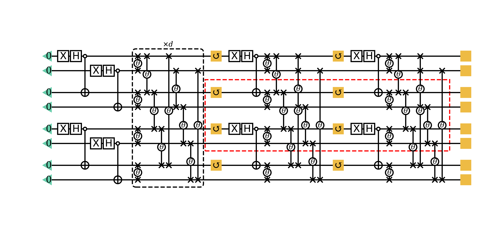

# PEPS inspired quantum circuit ansatz

To make life easier, [here](https://giggleliu.github.io/TwoQubit-VQE.html) is a simplified notebook version of MPS inspired qubit saving scheme for VQE. For a PEPS inpired ansatz solving the J1-J2 square lattice model, please checkout the following content.



## To Install

Type `]` in a [Julia REPL](https://docs.julialang.org/en/v1/stdlib/REPL/index.html) to enter the `pkg` mode, then type
```julia pkg
pkg> dev https://github.com/GiggleLiu/QuantumPEPS.jl.git
```

## To Run
First, enter the directory `~/.julia/dev/QuantumPEPS/` (the default development directory of Julia) in a terminal.

To run a toy example of J1-J2 model of size 4 x 4 with J2 = 0.5, type
```bash
julia> using QuantumPEPS

julia> Demo.j1j2peps(4, 4; use_cuda=true, )
```

## To Cite
```bibtex
@article{Liu_2019,
	doi = {10.1103/physrevresearch.1.023025},
	url = {https://doi.org/10.1103%2Fphysrevresearch.1.023025},
	year = 2019,
	month = {sep},
	publisher = {American Physical Society ({APS})},
	volume = {1},
	number = {2},
	author = {Jin-Guo Liu and Yi-Hong Zhang and Yuan Wan and Lei Wang},
	title = {Variational quantum eigensolver with fewer qubits},
	journal = {Physical Review Research}
}
```

[Download paper](https://journals.aps.org/prresearch/pdf/10.1103/PhysRevResearch.1.023025)
